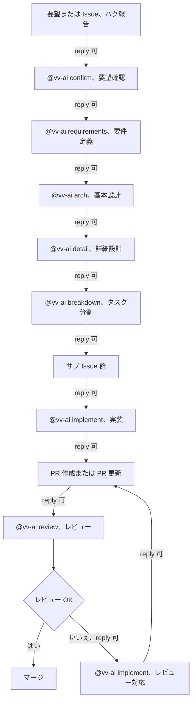
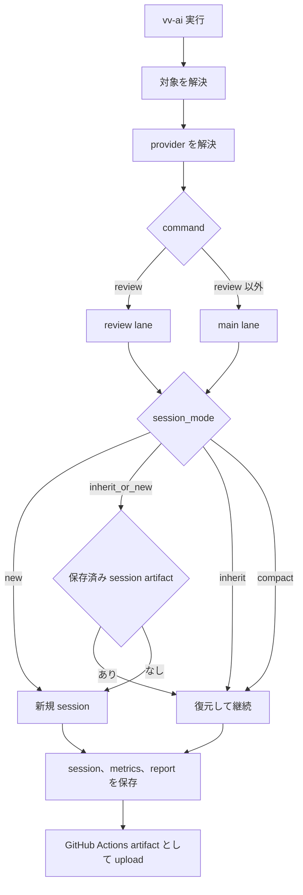
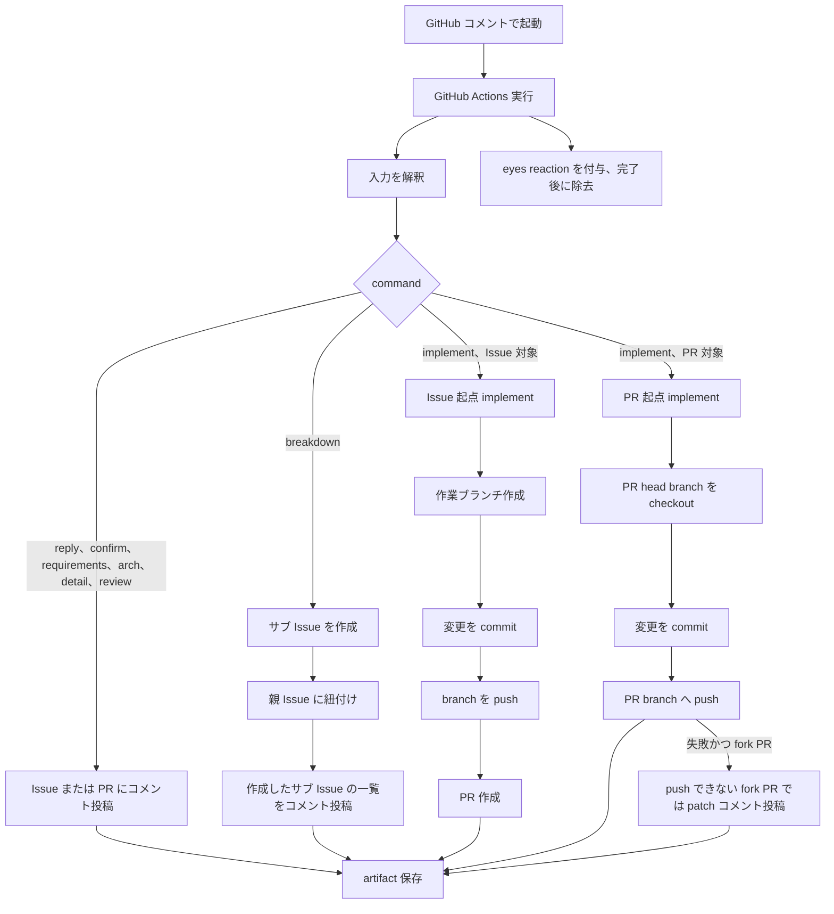

# vv-ai

Codex CLI と Claude Code CLI を活用し、GitHub Actions とローカル実行の両方で動かす AI 自動化ツールキットです。

Issue / PR へのコメントやワークフロー手動実行から AI を起動し、計画・実装・レビュー・Issue 作成などのタスクを自動実行します。

## セットアップ

前提条件:

- Python 3.12
- uv
- age（artifact の暗号化・復号に使用）
- Codex CLI または Claude Code CLI のいずれか
- gh（GitHub 操作に使用）

uvx を使えばクローン不要で GitHub から直接実行できます。

```sh
uvx --from git+https://github.com/Hiroshiba/vv-ai@main vv-ai --help
```

## 設定

### vv-ai.yml

リポジトリルートに `vv-ai.yml` を配置します。

```yaml
allowed_users:
  - Hiroshiba

provider_priority:
  - codex
  - claude
```

| 項目 | 必須 | 説明 |
| --- | --- | --- |
| `allowed_users` | 必須 | コマンド実行を許可する GitHub ユーザーの一覧 |
| `provider_priority` | 任意 | プロバイダの優先順。デフォルトは `[codex, claude]` |

### Secrets

以下の Secrets を登録します。

| 名前 | 必須 | 用途 |
| --- | --- | --- |
| `VV_AI_AGE_PUBLIC_KEY` | 必須 | artifact 暗号化に使う公開鍵 |
| `VV_AI_AGE_SECRET_KEY` | 必須 | artifact 復号に使う秘密鍵 |
| `VV_AI_APP_ID` | 必須 | read/write 両方のインストールトークン生成に使う GitHub App ID |
| `VV_AI_APP_PRIVATE_KEY` | 必須 | GitHub App の RSA 秘密鍵 |
| `VV_ANTHROPIC_API_KEY` | Claude 用 | Claude Code CLI 用 API キー |
| `VV_OPENAI_API_KEY` | Codex 用 | Codex CLI 用 API キー。`VV_CODEX_AUTH_JSON` と択一 |
| `VV_CODEX_AUTH_JSON` | Codex 用 | Codex CLI の OAuth 認証 JSON。`VV_OPENAI_API_KEY` と択一 |
| `VV_CLAUDE_SETTINGS` | 任意 | モデル名・Base URL・MCP サーバーなどを指定する Claude Code の追加設定 JSON |
| `VV_CONTEXT7_API_KEY` | 任意 | Context7 MCP の API キー。設定すると Claude Code / Codex 両方で Context7 が有効になる |

GitHub App にはリポジトリ権限として `Contents: Read & Write` / `Issues: Read & Write` / `Pull requests: Read & Write` / `Workflows: Read & Write` / `Metadata: Read-only` を付与します。

`VV_CODEX_AUTH_JSON` と `VV_CLAUDE_SETTINGS` はツールで設定できます。

```sh
uvx --from git+https://github.com/Hiroshiba/vv-ai@main set-codex-auth-secret --repo org/repo
uvx --from git+https://github.com/Hiroshiba/vv-ai@main set-claude-settings-secret --repo org/repo
```

ローカル実行では、環境変数に直接セットするか `_FILE` サフィックスでファイルパスを渡します。

```sh
export VV_ANTHROPIC_API_KEY_FILE=/path/to/anthropic_key
export VV_OPENAI_API_KEY_FILE=/path/to/openai_key
export VV_AI_AGE_PUBLIC_KEY_FILE=/path/to/age_public_key
export VV_AI_AGE_SECRET_KEY_FILE=/path/to/age_secret_key
export VV_CODEX_HOME=/path/to/codex_home
```

## ローカル実行

`--event local` がデフォルトです。

```sh
uvx --from git+https://github.com/Hiroshiba/vv-ai@main vv-ai --command requirements --target-url https://github.com/org/repo/issues/123 --instruction "要件を整理して"
uvx --from git+https://github.com/Hiroshiba/vv-ai@main vv-ai --command implement --target-url https://github.com/org/repo/issues/123 --dry-run
uvx --from git+https://github.com/Hiroshiba/vv-ai@main vv-ai --command reply --target-type issue --target-number 123 --instruction "このIssueの要点を教えて"
```

主要な引数:

| 引数 | 説明 |
| --- | --- |
| `--command` | `confirm` / `requirements` / `arch` / `detail` / `breakdown` / `implement` / `review` / `issue` / `reply` |
| `--instruction` | 自然言語の指示本文 |
| `--target-url` | 対象の Issue / PR URL またはローカルパス |
| `--target-type` | `issue` または `pr` |
| `--target-number` | Issue / PR 番号 |
| `--provider` | `codex` または `claude` |
| `--session_mode` | `inherit` / `inherit_or_new` / `compact` / `new`。デフォルトは `inherit_or_new` |
| `--dry-run` | GitHub への外部反映を行わず、artifact のみ保存する |
| `--repo` | Issue 作成先の `org/repo`。`issue` コマンド専用 |
| `--event-file` | GitHub event payload JSON を読み込んで再現実行する |

## GitHub Actions

### コメント起動

Issue または PR のコメントで `@vv-ai` で始めると起動します。

```
@vv-ai confirm この変更要望の意図を確認して
@vv-ai requirements このIssueの要件を整理して
@vv-ai implement --provider codex このIssueを実装して
@vv-ai review --session_mode new このPRをレビューして
```

`vv-ai.yml` の `allowed_users` に含まれるユーザーのコメントのみ反応します。未許可ユーザーには何も返しません。

### 運用フロー

`reply 可` は、その区間で `@vv-ai reply` や通常コメントによる壁打ちを挟めることを表します。



セッションは対象、provider、lane ごとに保存されます。`review` は review lane、それ以外のコマンドは main lane を使います。



GitHub 上の副作用はコマンドごとに異なります。



### workflow_dispatch

`gh workflow run` で手動起動します。

```sh
gh workflow run vv-ai.yml \
  -f command=requirements \
  -f target_url=https://github.com/org/repo/issues/123 \
  -f instruction="実装方針を3案ください"
```

入力項目: `command`, `target_type`, `target_number`, `target_url`, `instruction`, `provider`, `session_mode`, `dry_run`, `repo`

実行結果は GitHub Actions の Run と artifact から確認します。コメントやリアクションは返しません。

### 導入手順

1. `.github/workflows/vv-ai.yml` をリポジトリにコピーする
2. リポジトリの Settings > Secrets and variables > Actions に必要な Secret を登録する
3. リポジトリルートに `vv-ai.yml` を配置する

workflow には `contents: write`, `issues: write`, `pull-requests: write` の権限が必要です。

## Reusable Workflow 化の前提

現状は各リポジトリにソースをコピーするプロトタイプ方式です。将来 Reusable Workflow に切り出す際の設計前提:

- workflow は薄いオーケストレーターで、実処理は Python CLI に集約済み
- CLI の起動経路は `--event` と `--event-file` で抽象化済みのため、caller workflow から呼び出しやすい構造になっている
- Secrets は `_FILE` 環境変数でファイルパスとして渡す方式のため、caller workflow から secrets を受け渡しできる
